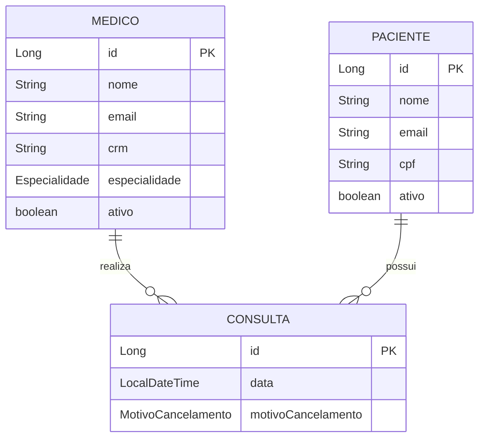

# Vollmed API - Sistema de Gestão Médica

## Visão Geral do Projeto

API RESTful desenvolvida em Spring Boot para gerenciamento de clínicas médicas, criada como parte do programa Oracle Next Education (ONE). A aplicação oferece endpoints completos para administração de consultas, médicos e pacientes.

## Tecnologias Principais

- **Linguagem**: Java 17
- **Framework**: Spring Boot 3.1+
- **Banco de Dados**: MySQL com Flyway para migrações
- **Segurança**: Spring Security + JWT
- **Documentação**: SpringDoc OpenAPI 3.0

## Arquitetura

- **Padrão RESTful**
- **Arquitetura em camadas**:
  - Controller → Service → Repository
- **Validações**:
  - Bean Validation
  - Tratamento de exceções global
- **Testes**:
  - Unitários (JUnit 5)
  - Integração (SpringBootTest)

## Configuração do Ambiente

### Pré-requisitos

- Java 17 JDK
- MySQL 8.0+
- Maven 3.8+

### Instalação

1. Clone o repositório
2. Configure o banco de dados no `application.properties`
3. Execute as migrações:

```bash
mvn flyway:migrate
```

4. Inicie a aplicação:

```bash
mvn spring-boot:run
```

## Endpoints Principais

### Autenticação

| Método | Endpoint | Descrição      |
| ------ | -------- | -------------- |
| POST   | /login   | Gera token JWT |

### Médicos

| Método | Endpoint      | Descrição                     |
| ------ | ------------- | ----------------------------- |
| POST   | /medicos      | Cadastra novo médico          |
| GET    | /medicos      | Lista médicos ativos          |
| PUT    | /medicos/{id} | Atualiza médico               |
| DELETE | /medicos/{id} | Desativa médico (soft delete) |

### Pacientes

| Método | Endpoint        | Descrição                       |
| ------ | --------------- | ------------------------------- |
| POST   | /pacientes      | Cadastra novo paciente          |
| GET    | /pacientes      | Lista pacientes ativos          |
| PUT    | /pacientes/{id} | Atualiza paciente               |
| DELETE | /pacientes/{id} | Desativa paciente (soft delete) |

### Consultas

| Método | Endpoint   | Descrição            |
| ------ | ---------- | -------------------- |
| POST   | /consultas | Agenda nova consulta |
| DELETE | /consultas | Cancela consulta     |

## Documentação da API

Acesse a documentação interativa após iniciar a aplicação:

```
http://localhost:8080/swagger-ui.html
```

## Modelo de Dados



## Autor

Wilker J C Pimenta  
Oracle Next Education (ONE) - T6 - Alura

## Licença

Projeto desenvolvido para fins educacionais como parte do programa ONE.
